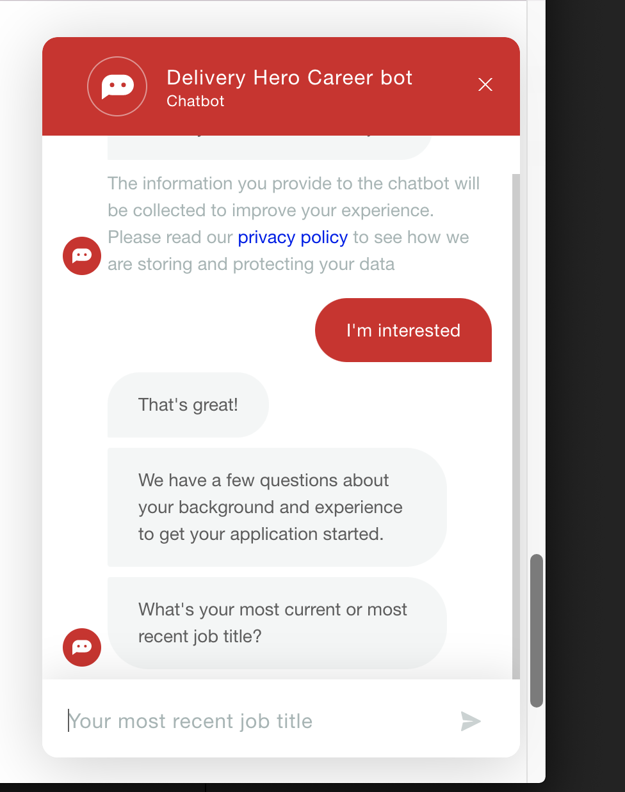

# SUPPLY HERO

A very basic app for chat between restaurants and suppliers ! very basic !

Just Chat between a restaurant agent and a supplier.

All Made with Flutter and Dart

Inspired from this

## Web Demo Page

https://bot-labs-313.firebaseapp.com/

 - Supplier 
login : supplier@test.com
password : admin123

 - Restaurant 
 login : resto@test.com
 password : admin123

## Getting Started
- Firebase setup for web version of flutter.
- Created web version just for simplicty sake 😎
- Add your correct Firebase web project informations in the section inside web/index.html file

# What else could be added ?
## Technical Side
- State management solution like Bloc or Riverpod as the app Scale
- Widget and unit Test
- Firebase Auth
- Mobile view
- Waiting the user to blur or using kind of debounce time to validate input fields (Login Page)
- ....

## Functional Side
In Chat Order or Specific Order Page
Order Status and so on
....

